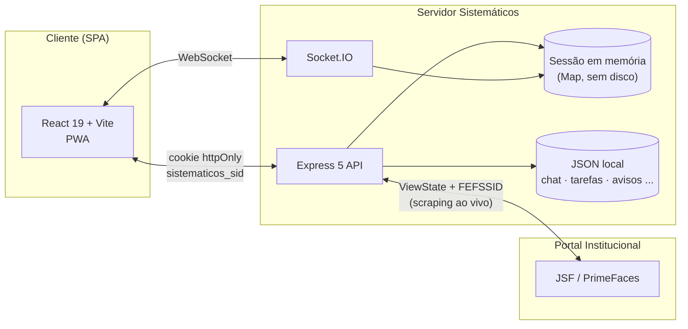
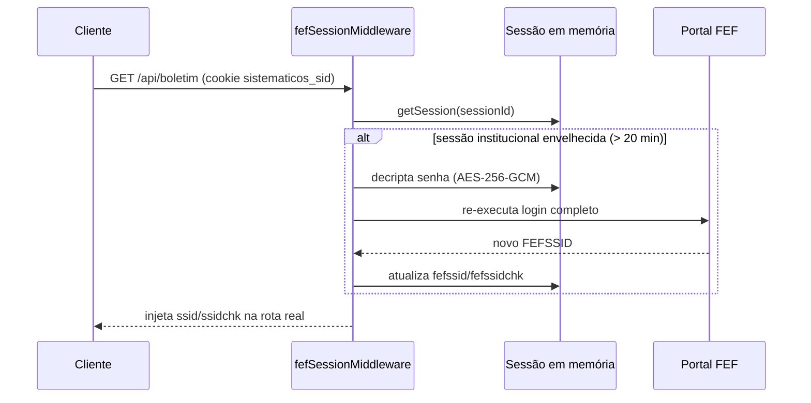
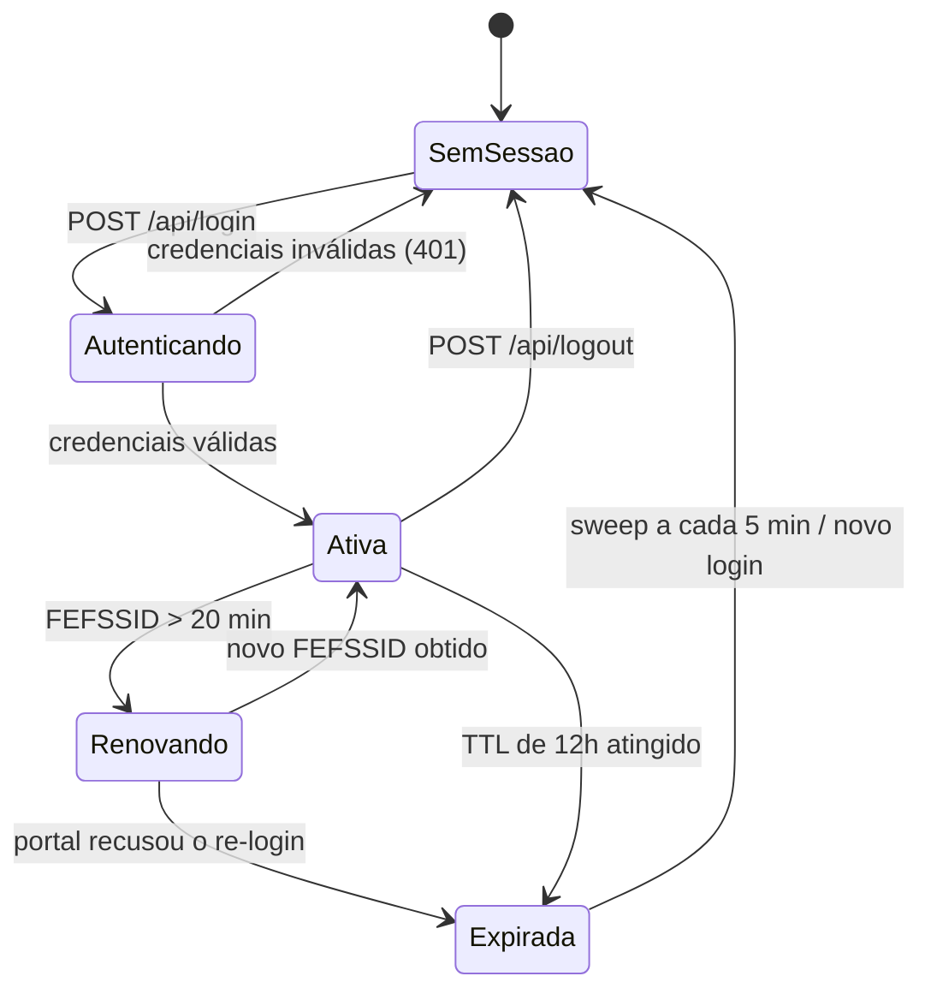
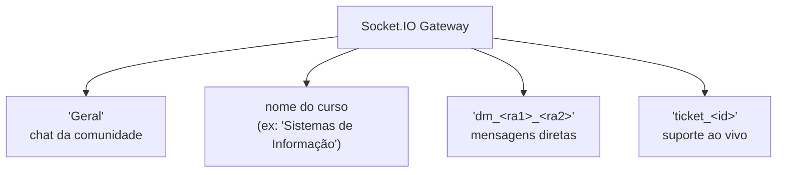

# Arquitetura

Este documento descreve, em profundidade, como o **Sistemáticos** funciona por dentro: o gateway de sessão, a emulação do formulário JSF/PrimeFaces do portal institucional, a topologia de tempo real, o mapa de rotas e as decisões de engenharia por trás de cada escolha.

Como este é um repositório-vitrine, o código-fonte do motor de scraping não é distribuído — este documento existe para que outros desenvolvedores entendam a arquitetura sem precisar do código em mãos.

> **TL;DR** — o servidor __não guarda__ notas, faltas ou boletos. Ele guarda só uma sessão-ponte em memória (RA autenticado + cookie institucional cifrado) e resolve tudo o mais *ao vivo*, direto no portal oficial, a cada requisição.

## Índice

- [Visão geral](#visão-geral)
- [Fluxo de autenticação](#fluxo-de-autenticação)
- [Sessão e refresh em segundo plano](#sessão-e-refresh-em-segundo-plano)
- [Camada de scraping](#camada-de-scraping)
- [Mapa de rotas da API](#mapa-de-rotas-da-api)
- [Tempo real (Socket.IO)](#tempo-real-socketio)
- [Frontend](#frontend)
- [Build, ambiente e deploy](#build-ambiente-e-deploy)
- [Decisões de arquitetura](#decisões-de-arquitetura)
- [Postura de segurança](#postura-de-segurança)
- [Alinhamento com a LGPD](#alinhamento-com-a-lgpd)
- [Glossário](#glossário)

---

## Visão geral

O princípio central é **não duplicar o registro acadêmico do aluno**. O servidor não tem banco de dados de notas, frequência ou matrícula — cada requisição acadêmica é resolvida ao vivo contra o portal oficial da instituição (JSF/PrimeFaces). O que o servidor mantém é apenas uma **sessão-ponte em memória**, representando "este RA está autenticado agora e aqui está a sessão institucional dele".



Em produção, o Express serve tanto a API/WebSocket quanto o build estático da SPA a partir do **mesmo processo Node** — não há separação entre "frontend host" e "backend host": um único servidor responde por tudo.

---

## Fluxo de autenticação

O login não é uma chamada a uma API REST da instituição — é a emulação do formulário JSF real: cada etapa exige ler o `ViewState` corrente da página antes de enviar a próxima ação, exatamente como o navegador do aluno faria.

```mermaid
sequenceDiagram
    actor Aluno
    participant Client as Cliente (SPA)
    participant Server as Servidor Sistemáticos
    participant FEF as Portal FEF (JSF)

    Aluno->>Client: RA + senha
    Client->>Server: POST /api/login
    Server->>FEF: GET /alunos/login
    FEF-->>Server: HTML + ViewState + cookie FEFSSID
    Server->>FEF: POST partial/ajax (usuário, senha, ViewState)
    FEF-->>Server: "Usuário e/ou senha inválidos" OU sucesso
    alt credenciais inválidas
        Server-->>Client: 401
    else sucesso
        Server->>FEF: GET home (dispensa modais/interstitials)
        Server->>FEF: GET perfil (nome, curso, e-mail, foto, endereço)
        Server->>FEF: detecta semestre atual (varre anos/semestres do boletim)
        Server->>Server: cria sessão em memória<br/>senha cifrada com AES-256-GCM
        Server-->>Client: Set-Cookie sistematicos_sid<br/>(httpOnly, SameSite=Lax, Secure em produção)
        Client->>Client: guarda apenas dados de exibição<br/>(nome/curso/foto) no localStorage
    end
```



Pontos importantes:
- O cookie de sessão do Sistemáticos (`sistematicos_sid`) é um ID opaco de 32 bytes aleatórios — ele **não é** o cookie da FEF. O cliente nunca vê `FEFSSID`/`FEFSSIDCHK`.
- A senha só existe cifrada (AES-256-GCM, chave derivada via SHA-256 de `SESSION_SECRET`) dentro do registro de sessão em memória, para permitir o re-login automático descrito na próxima seção. Ela nunca é gravada em disco nem loga em texto claro.
- O `localStorage` do navegador guarda apenas um objeto de exibição (nome, curso, foto) para hidratar a UI instantaneamente — a fonte da verdade é sempre o cookie `httpOnly`, validado a cada carregamento via `GET /api/session/me`.
- **Interstitials automáticos:** o portal às vezes intercala modais obrigatórios (comunicados, "altere sua senha") entre o login e a home. O servidor detecta esses formulários pelo `id` e envia o clique de dispensa via o mesmo protocolo `partial/ajax`, em loop, até a página real aparecer (limite de 5 iterações).
- **Detecção de semestre:** não existe um campo "semestre atual" pronto no portal. O servidor varre os `<select>` de ano/semestre do boletim, identifica o mais antigo disponível e calcula quantos semestres se passaram até hoje.
- **Modo convidado** não passa por nada disso: é um usuário fictício criado inteiramente no cliente (`loginAsGuest()`), sem cookie de sessão real e sem qualquer contato com a FEF.
- **Recuperação de senha** (`POST /api/recover-password`) não reimplementa nada por conta própria: o servidor emula o mesmo formulário "esqueci minha senha" do portal oficial (RA, e-mail e data de nascimento), a validação de quem confere ou não os dados acontece inteiramente do lado da FEF.

### Exemplo: requisição e resposta

O cliente nunca sabe nada sobre `FEFSSID`, `ViewState` ou JSF — do ponto de vista dele, é só um `POST` comum:

```http
POST /api/login HTTP/1.1
Content-Type: application/json

{
  "username": "125314106669",
  "password": "••••••••••••"
}
```

Em caso de sucesso, o servidor devolve o perfil já pronto para hidratar a UI — note que **nenhum campo de sessão da FEF** (`fefssid`, `fefssidchk`) aparece na resposta:

```json
{
  "user": {
    "username": "125314106669",
    "fullName": "Murilo Rocha Silva",
    "course": "Sistemas de Informação",
    "currentSemester": "4º Semestre",
    "photoUrl": "/api/proxy/photo?target=...&ssid=..."
  }
}
```

O `Set-Cookie` vai no header da resposta, não no corpo:

```http
Set-Cookie: sistematicos_sid=3f9a1c...b02e; HttpOnly; SameSite=Lax; Max-Age=43200
```

Em caso de credenciais inválidas:

```json
{ "error": "RA ou Senha incorretos" }
```

> _Observação:_ o payload acima é **ilustrativo** — reconstruído a partir do formato real das respostas, não uma captura de tráfego real.

---

## Sessão e refresh em segundo plano

A sessão da FEF (`FEFSSID`) expira bem mais rápido do que a sessão do Sistemáticos (12h por padrão). Em vez de forçar o aluno a relogar no meio do uso, o servidor renova a sessão institucional sozinho, de forma transparente:



Duas decisões evitam problemas comuns desse padrão:

- **De-duplicação de refresh em voo.** Um carregamento de página dispara várias chamadas de API em paralelo (dashboard, boletim, horário, avisos...). Sem controle, cada uma notaria a sessão institucional velha ao mesmo tempo e disparia login duplicado contra o portal real — o que o portal real tende a falhar ou limitar. Um `Map` de promises em andamento por `sessionId` garante que só a primeira chamada relogue; as demais aguardam o mesmo resultado.
- **Sem persistência.** A sessão vive só em `Map` na memória do processo. Um restart do servidor derruba todo mundo — comportamento aceito de propósito, já que a alternativa (persistir credenciais cifradas em disco/Redis) aumentaria a superfície de risco sem necessidade real: a sessão é barata de recriar (é só um login).
- **Recuperação reativa no cliente.** Se qualquer chamada autenticada volta `401`, `authenticatedFetch` no frontend força uma renovação (`/api/session/me?reactive=1`) e só então repete a chamada original — sem esperar o timer proativo de 20 minutos.

### Ciclo de vida da sessão



### O registro de sessão, por dentro

Cada entrada do `Map` em memória tem, conceitualmente, este formato — `passwordEnc` é a **única** informação sensível ali, e nunca sai cifrada em texto puro:

```ts
type SessionRecord = {
  ra: string;              // RA do aluno — chave de negócio
  passwordEnc: string;     // AES-256-GCM: base64(iv || authTag || ciphertext)
  fefssid: string;         // cookie de sessão da FEF (nunca exposto ao cliente)
  fefssidchk: string;
  fefssidIssuedAt: number; // usado para decidir quando renovar (> 20 min)
  createdAt: number;
  lastUsedAt: number;
  expiresAt: number;       // TTL de 12h, renovado a cada uso
};
```

### Erro típico de sessão expirada

Quando uma rota acadêmica detecta que a sessão da FEF morreu no meio do caminho (não o cookie do Sistemáticos — a sessão *institucional* por trás dele), a resposta é um `401` simples que o `authenticatedFetch` do frontend sabe interpretar e resolver sozinho:

```json
{ "error": "Sessão expirada ou inválida" }
```

---

## Camada de scraping

Todas as rotas acadêmicas somente-leitura (boletim, horário, matriz curricular, calendário, cronograma, atividades) seguem o mesmo adaptador, reaproveitado a partir do módulo de autenticação:

1. **GET** da página institucional com os headers padronizados (`FEF_HEADERS`), usando o `ssid`/`ssidchk` injetados pelo middleware de sessão.
2. **Detecção de estado da resposta**, nesta ordem: sessão expirada (redireciona para `/alunos/login`) → acesso restrito (403 / "Erro [403]") → interstitial pendente (modal de comunicado) → conteúdo real.
3. **Extração do `ViewState`** corrente do HTML (necessário para qualquer interação seguinte na mesma página JSF).
4. **POST `partial/ajax` opcional**, quando a rota aceita filtro (ano, semestre, disciplina): o servidor envia o filtro do mesmo jeito que o componente PrimeFaces enviaria, recebe uma resposta XML com o HTML atualizado dentro de um bloco `CDATA`, e recarrega esse fragmento no Cheerio.
5. **Extração estruturada** dos dados relevantes com seletores Cheerio e devolução como JSON limpo para o cliente — o frontend nunca lida com HTML bruto do portal.

Essa camada centraliza o único ponto de contato com a instabilidade do portal real: timeouts, mudanças de layout ou indisponibilidade momentânea são tratados aqui (com retries pontuais, como no scraping de perfil durante o login) em vez de vazarem para cada tela da aplicação.

### O protocolo por baixo: PrimeFaces `partial/ajax`

Quando uma rota precisa aplicar um filtro (ano, semestre), o corpo enviado ao portal é `x-www-form-urlencoded`, no formato exato que o componente PrimeFaces geraria no navegador:

```
jakarta.faces.partial.ajax=true
jakarta.faces.source=sem
jakarta.faces.partial.execute=sem ano
jakarta.faces.partial.render=form-boletim
jakarta.faces.behavior.event=valueChange
sem=2
ano=2026
jakarta.faces.ViewState=8172387123:912873198
```

A resposta não é JSON — é um XML do PrimeFaces com o HTML atualizado embrulhado em `CDATA`, que o servidor extrai antes de recarregar no Cheerio:

```xml
<partial-response>
  <changes>
    <update id="form-boletim"><![CDATA[
      <div id="form-boletim">... HTML atualizado da tabela ...</div>
    ]]></update>
  </changes>
</partial-response>
```

### Exemplo: `GET /api/boletim` já normalizado

O que o frontend efetivamente recebe — HTML nenhum, só dados prontos para renderizar:

```json
{
  "boletim": [
    {
      "disciplina": "Estrutura de Dados I",
      "docente": "Prof. Exemplo da Silva",
      "cargaHoraria": "30h",
      "frequencia": 95,
      "notas": { "n1": 8.5, "n2": 7.0, "media": 7.6 },
      "status": "Em Curso"
    }
  ],
  "availableYears": [2023, 2024, 2025, 2026],
  "availableSemesters": [1, 2]
}
```

---

## Mapa de rotas da API

O servidor expõe quase 80 rotas HTTP, agrupadas por domínio:

| Domínio | Rotas principais | Propósito |
| :-- | :-- | :-- |
| **Autenticação e sessão** | `POST /api/login`, `/api/login/guest`, `/api/logout`, `GET /api/session/me`, `POST /api/recover-password` | Login real, modo convidado, encerramento de sessão, checagem de sessão ativa, recuperação de senha |
| **Acadêmico (proxy ao vivo)** | `GET /api/boletim`, `/api/horario-aula`, `/api/calendario`, `/api/matriz`, `/api/atividades(/resumo)`, `/api/nupex`, `/api/cronograma`, `/api/fefsis/aulas/*`, `/api/dashboard/home` | Notas, frequência, horários, matriz curricular, atividades complementares, aulas/materiais e o resumo do dashboard — sempre lidos ao vivo do portal |
| **Financeiro** | `GET /api/mensalidade`, `POST /api/mensalidade/pix`, `/mensalidade/confirmar`, `/mensalidade/baixar-pdf`, `DELETE /api/mensalidade/:id` | Boletos, PIX dinâmico, confirmação de pagamento e emissão de PDF |
| **Portal institucional (público)** | `GET /api/fef-landing`, `/api/fef/noticias`, `/api/fef/cursos`, `/api/fef/curso-detalhes`, `/api/fef-institutional` | Notícias, cursos e páginas institucionais da FEF — não exigem sessão de aluno |
| **Comunidade e social** | `GET/POST /api/messages`, `GET /api/public/alunos`, `/api/direct/conversations`, `POST /api/profile/update` | Chat (histórico via HTTP, tempo real via socket), diretório de estudantes, conversas diretas |
| **Produtividade pessoal** | `GET/POST/DELETE /api/tasks`, `/api/reminders` | Kanban de tarefas e lembretes por RA |
| **Avisos e gestão** | `GET/POST/DELETE /api/avisos`, `GET/POST /api/admin/admins`, `GET /api/notifications/active`, `POST /api/system/popup` | Mural de comunicados, gestão de administradores, popups de sistema |
| **Suporte** | `GET /api/public/suporte/tickets/:ra`, `/suporte/admins`, `/suporte/ticket/:id`, `DELETE /api/admin/suporte/ticket/:id` | Central de atendimento (histórico via HTTP; conversa ao vivo via socket) |
| **Sugestões** | `GET/POST/PUT/DELETE /api/public/sugestoes` (+ `/vote`, `/comment`, `/status`) | Mural de ideias com votação e comentários |
| **Doações** | `POST /api/donations/checkout`, `/webhook`, `GET /verify/:id`, `/stats` | Doações voluntárias via PIX (InfinitePay), com ranking de apoiadores |
| **Atlética / Classroom** | `GET/POST /api/atletica*`, `GET /api/classroom` | Loja e agenda da atlética, feed de materiais do Classroom |
| **Perfil social** | `POST /api/public/alunos/like`, `/update`, `/upload` | Curtir perfil de colega, editar bio/redes/galeria/privacidade, upload de foto |
| **Notificações institucionais** | `GET /api/fef-notifications`, `POST /api/avisos/read` | Espelha os avisos nativos do portal oficial e marca comunicados como lidos |
| **Administração financeira interna** | `GET /api/payments` | Painel restrito a admins para controle de inscrições pagas em eventos internos do curso (não é o financeiro do aluno — isso é `/api/mensalidade`) |
| **Infra** | `GET /api/proxy/photo`, `/api/proxy/ping` | Proxy de foto de perfil (evita expor o cookie da FEF ao navegador do aluno) e healthcheck |

Todas as rotas sob `/api/*` (exceto login/logout/session) passam primeiro pelo rate limiter geral e pelo `fefSessionMiddleware` descrito acima.

### Experimente: uma rota pública

`GET /api/fef/cursos` não exige sessão — é só um espelho dos cursos listados no site institucional, então dá para testar direto:

```bash
curl https://sistematicos.site/api/fef/cursos
```

```json
[
  { "title": "Administração", "url": "https://fef.br/graduacao/administracao", "icon": "https://fef.br/icons/adm.svg" },
  { "title": "Sistemas de Informação", "url": "https://fef.br/graduacao/sistemas-de-informacao", "icon": "https://fef.br/icons/si.svg" }
]
```

---

## Tempo real (Socket.IO)

Uma única conexão de socket por cliente transita entre salas conforme a tela que o aluno está usando; `join_room` sempre sai de todas as salas anteriores antes de entrar na nova.



- **Presença:** estudantes e admins online são rastreados em `Set`/`Map` no processo (não persistidos); a lista é recalculada e re-emitida a cada conexão/desconexão, considerando múltiplas abas do mesmo RA.
- **Indicadores de digitação** (`typing_start`/`typing_stop`) são retransmitidos por sala, com um evento global adicional para DMs, para que a lista de conversas mostre "digitando..." mesmo fora da conversa aberta.
- **Autorização por sala:** as rotas HTTP que servem histórico (`GET /api/messages`) reaplicam a mesma regra de acesso da sala (comunidade, curso do aluno, ou participante do DM) — o socket não é a única barreira; um cliente não pode simplesmente pedir o histórico de uma sala que não deveria ver.
- **Suporte:** cada chamado vira uma sala própria (`ticket_<id>`), permitindo transferência entre atendentes e reconexão após refresh de página sem perder o histórico da conversa.
- **Broadcasts globais:** avisos administrativos, popups de sistema e confirmações de doação usam `io.emit` (todos os clientes conectados), independente de sala.

### Exemplo: evento de chat

O cliente emite `new_message` com o texto e a sala; o servidor persiste, marca se o remetente é admin e retransmite para todo mundo na sala:

```js
// Cliente → Servidor
socket.emit('new_message', {
  username: '125314106669',
  content: 'Alguém tem o slide da aula de hoje?',
  room: 'Sistemas de Informação',
});
```

```json
// Servidor → todos os clientes na sala ("message_received")
{
  "id": 1755882345123,
  "username": "125314106669",
  "fullName": "Murilo Rocha Silva",
  "content": "Alguém tem o slide da aula de hoje?",
  "timestamp": "2026-08-22T19:32:25.123Z",
  "room": "Sistemas de Informação"
}
```

---

## Frontend

```
src/
├── pages/         # uma página por rota, lazy-loaded via React Router
│   ├── Termos.tsx, Privacidade.tsx   # documentos legais reais, servidos em /termos e /privacidade
│   ├── Hub.tsx                       # simulador de CR, banco de provas, carreira, rede — em rollout, não linkado no menu ainda
│   └── Ferramentas.tsx               # monitor de aprovação (dados reais) + gerador de capa ABNT
├── components/
│   ├── layout/    # Sidebar (com personalização), BottomNav, CommandPalette, SidebarCustomizeModal, modais globais
│   ├── home/      # widgets do dashboard: clima (Open-Meteo), calendário institucional, notícias, atividades pendentes
│   ├── common/    # elementos reutilizáveis entre páginas (inclui CookieConsentBanner)
│   └── ui/        # primitivos shadcn/ui (Radix / Base UI)
├── contexts/      # AuthContext, SocketContext, ThemeContext, NotificationContext
├── hooks/ · lib/  # utilitários
```

- **Roteamento em três camadas** (`App.tsx`): rotas públicas de convidado, rotas que exigem sessão de aluno válida, e um grupo restrito a permissões administrativas — todas resolvidas antes do primeiro render da página.
- **Contextos como fonte única de estado transversal:** `AuthContext` expõe `authenticatedFetch`, que intercepta qualquer `401`, força uma renovação reativa da sessão FEF e só desloga o aluno se a renovação também falhar.
- **Tailwind CSS v4** com tokens semânticos (`--primary`, `--background`, `--card`) via `@theme inline`, permitindo alternância instantânea de tema sem repintura.
- **PWA com cache seletivo:** o Service Worker (Workbox, via `vite-plugin-pwa`) tem uma allowlist explícita por regex — só `avisos`, `fef-landing`, notícias e cursos entram no cache (`NetworkFirst`). Boletim, mensalidade e horário nunca são cacheados, para que dados pessoais não sobrevivam num dispositivo compartilhado.
- **Consentimento de cookies client-side:** `CookieConsentBanner` só decide entre "essenciais" e "todos" e grava a escolha em `localStorage` — não existe cookie de rastreamento de terceiros para consentir em primeiro lugar.
- **Navegação personalizável:** a Sidebar é organizada em grupos (ex.: *Vida Acadêmica*, *Social & Comunidade*, grupos restritos a admin); `SidebarCustomizeModal` deixa o aluno esconder grupos ou itens individuais, com a preferência salva por conta. Um `CommandPalette` (`Ctrl+K`) espelha o mesmo mapa de rotas com busca fuzzy, já filtrando por permissão (admin/convidado) antes de listar o comando.
- **Responsivo por layout, não por escala:** abaixo do breakpoint `lg`, a `Sidebar` fixa dá lugar a um `BottomNav` de navegação inferior — não é a mesma árvore de componentes encolhida, é uma troca deliberada de padrão de navegação para uso de uma mão em celular.
- **Widgets do dashboard rodam client-side:** o widget de clima consome a API pública do Open-Meteo diretamente do navegador (sem chave, sem passar pelo backend), fixado nas coordenadas de Fernandópolis; o calendário institucional e o painel de atividades pendentes reaproveitam `/api/calendario`, `/api/matriz` e `/api/boletim` já buscados por outras telas em vez de criar endpoints novos.

---

## Build, ambiente e deploy

O Sistemáticos roda em produção como um **único processo Node em uma VPS** — sem CDN, sem hosting separado para o frontend, sem containers:

```bash
npm run build   # tsc -b && vite build → gera dist/
npm start       # sobe o Express, que passa a servir dist/ + API + WebSocket juntos
```

- **Bundle:** `manualChunks` separa vendor de gráficos (`recharts`), geração de documentos (`jspdf`, `xlsx`) e UI (`framer-motion`, `lucide-react`) em chunks próprios, mantendo o bundle principal enxuto.
- **Servindo a SPA:** ao detectar a pasta `dist/` presente, o Express passa a servi-la como estático e aplica um catch-all de rota para qualquer caminho que não seja `/api/*` — o próprio React Router resolve a navegação no cliente a partir daí.
- **Um processo, uma porta:** a mesma instância Express que responde `/api/*` também aceita a conexão WebSocket do Socket.IO e serve o HTML/JS/CSS da SPA — reinicia junto, sobe junto, sem coordenação entre serviços distintos.

---

## Decisões de arquitetura

| Decisão | Alternativa considerada | Por que essa escolha |
| :-- | :-- | :-- |
| Sessão em `Map` na memória do processo | Redis / banco relacional | A sessão é barata de recriar (é só refazer o login); persistir credenciais cifradas em outro lugar só aumentaria a superfície de risco sem ganho real de disponibilidade |
| Um processo Node servindo API + WS + SPA | Frontend e backend em hosts/serviços separados | Simplicidade operacional para um projeto mantido por uma pessoa só, sem equipe de infra |
| Arquivos JSON como "banco" local | SQLite/Postgres | O volume de dados próprios da plataforma (chat, tarefas, avisos) é pequeno e não relacional; não há necessidade de um motor de banco para isso |
| Scraping ao vivo em vez de espelhar os dados | Sincronizar e cachear notas/frequência em banco próprio | Qualquer cache correria o risco de ficar desatualizado ou divergir do portal oficial — a fonte da verdade é sempre a FEF |
| Modo convidado 100% client-side | Convidado com sessão real no servidor | Não há necessidade de tocar a FEF para dar um preview da interface a quem ainda não é aluno |
| Calculadoras do Hub/Ferramentas rodam sobre dados já buscados (`/api/boletim`) | Rota de API dedicada para cada simulação | Simulador de médias e gerador de capa ABNT são só matemática/template em cima do que a tela já carregou — criar uma rota nova por ferramenta seria superfície de API sem necessidade real |
| Doações via link de checkout de terceiro (InfinitePay) | Processar cartão/PIX diretamente no servidor | O Sistemáticos nunca vê nem guarda dado de pagamento — o servidor só cria o link e escuta o webhook de confirmação, o que também mantém o projeto fora do escopo de conformidade de meios de pagamento |
| Widget de clima chama o Open-Meteo direto do navegador | Proxear a chamada pelo próprio backend | API pública, sem chave e sem dado pessoal no payload (só coordenadas fixas da cidade) — um proxy só adicionaria latência sem ganho de segurança |
| Hub Acadêmico publicado com conteúdo demonstrativo antes de estar 100% ligado a dados reais | Esconder a página até terminar | A interface (design, motion, layout) já reflete a visão final do módulo; o texto deixa claro o que é simulação enquanto os dados reais (banco de provas, vagas) são integrados aos poucos |

---

## Postura de segurança

| Controle | Implementação |
| :-- | :-- |
| Rate limiting de login | 10 tentativas / 15 min por IP |
| Rate limiting geral de API | 300 requisições / min por IP |
| Cookie de sessão | `httpOnly`, `SameSite=Lax`, `Secure` em produção |
| Segredo em repouso | Senha institucional cifrada com AES-256-GCM; chave nunca gravada, derivada em runtime a partir de `SESSION_SECRET` |
| Persistência de sessão | Nenhuma — em memória, TTL padrão de 12h, varredura a cada 5 min |
| Modo convidado | Totalmente isolado: usuário fictício client-side, sem cookie de sessão real, sem acesso à FEF |
| Auditoria | Cada login grava `{ timestamp, ra, ip, localizacao, dispositivo, navegador, sistemaOperacional }` — **nunca a senha** — e o registro é **sobrescrito** a cada novo login do mesmo RA (não é um histórico que cresce indefinidamente) |
| Exposição de credenciais da FEF | O cliente nunca recebe `FEFSSID`/`FEFSSIDCHK`; até a foto de perfil passa por um proxy (`/api/proxy/photo`) para não expor a sessão institucional em uma URL de imagem |

### Quando o limite é excedido

```json
{ "error": "Muitas tentativas de login. Tente novamente em alguns minutos." }
```

```http
HTTP/1.1 429 Too Many Requests
RateLimit-Limit: 10
RateLimit-Remaining: 0
RateLimit-Reset: 823
```

---

## Alinhamento com a LGPD

O Sistemáticos é um **projeto pessoal e acadêmico, sem fins lucrativos**, mas os controles técnicos já descritos neste documento foram desenhados observando os princípios da **Lei Geral de Proteção de Dados (Lei nº 13.709/2018)**:

| Princípio (art. 6º, LGPD) | Como se reflete na implementação |
| :-- | :-- |
| **Finalidade** | Cada dado tratado tem um uso explícito e único: a senha só autentica; o IP/dispositivo só serve à auditoria de login; nada é reaproveitado para outro fim. |
| **Necessidade / minimização** | Notas, frequência, boletos e horários nunca são persistidos — são buscados ao vivo e descartados após a resposta. O registro de auditoria de login guarda só o **último acesso** por RA (sobrescrito a cada login), nunca um histórico acumulado. |
| **Segurança** | Senha institucional cifrada em repouso (AES-256-GCM), cookie de sessão `httpOnly`/`SameSite`, rate limiting contra força bruta. |
| **Prevenção e não retenção** | Sessão inteiramente em memória, com TTL curto e varredura periódica — não há um banco de credenciais para vazar. |
| **Transparência** | Este documento e o [README](./README.md) descrevem publicamente, em detalhe, como os dados são tratados. |
| **Livre acesso e eliminação** | O titular pode solicitar ao autor a exclusão de qualquer dado gerado pelo próprio uso da plataforma (mensagens, tarefas, sugestões) a qualquer momento. |

### Quem é o controlador de quê

É importante distinguir os papéis: o **registro acadêmico oficial** (notas, frequência, matrícula) continua sob controle exclusivo da instituição — a FEF é a controladora desses dados, e mantém seu próprio Encarregado de Dados (`lgpd@fef.edu.br`, publicado em [fef.br/instituicao/lgpd](https://fef.br/instituicao/lgpd)). O Sistemáticos **não assume esse papel**: ele apenas intermedeia, a pedido do próprio titular, o acesso a dados que já existem na FEF, e trata localmente somente o que é gerado pelo uso da própria plataforma (sessão, chat, tarefas).

A plataforma mantém uma **[Política de Privacidade](https://sistematicos.site/privacidade)** e **[Termos de Uso](https://sistematicos.site/termos)** formais, em rotas próprias (`/privacidade`, `/termos`), voltadas ao usuário final — apresentadas no primeiro acesso via o banner de cookies. Esta seção documenta, para desenvolvedores, **como** os princípios da lei se traduzem em decisões técnicas concretas.

---

## Glossário

Termos específicos da stack do portal institucional, para quem nunca mexeu com JSF:

| Termo | O que é |
| :-- | :-- |
| **JSF** _(Jakarta/JavaServer Faces)_ | Framework Java para construir interfaces web server-side — cada interação gera uma requisição ao servidor, que devolve HTML (ou um fragmento) já processado. |
| **PrimeFaces** | Biblioteca de componentes visuais sobre o JSF (tabelas, selects, modais) — é dela o protocolo `partial/ajax` usado nas atualizações parciais de página. |
| **ViewState** | Um token opaco que o JSF injeta em todo formulário, representando o estado atual daquela página no servidor. Sem reenviá-lo, o servidor não sabe "de onde" a próxima ação está partindo. |
| **`FEFSSID` / `FEFSSIDCHK`** | Os cookies de sessão do portal institucional — o equivalente ao `JSESSIONID` de uma aplicação Java comum. O Sistemáticos os guarda, mas nunca os expõe ao navegador do aluno. |
| **RA** | Registro Acadêmico — a matrícula do aluno na FEF, usada como identificador único em toda a plataforma. |
| **Interstitial** | Um modal ou página intermediária que o portal força entre o login e o conteúdo real (comunicados, troca de senha obrigatória). |
| **Cheerio** | Biblioteca Node que implementa uma API estilo jQuery para percorrer e extrair dados de HTML no servidor — é o que faz o papel de "parser" em toda a camada de scraping. |

---

<p align="center"><em>Dúvidas, sugestões ou encontrou algo estranho neste documento? Abra uma <strong>issue</strong> — este repositório é a vitrine, mas a conversa é bem-vinda.</em></p>
