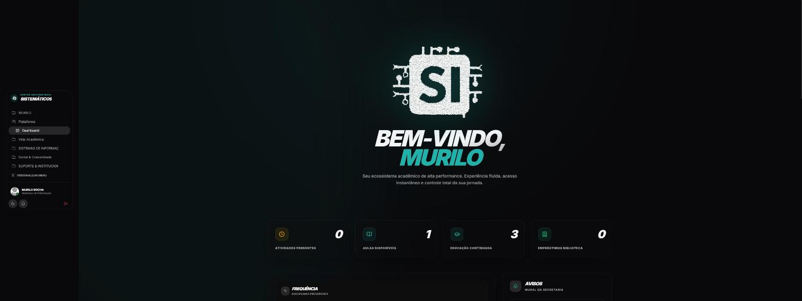
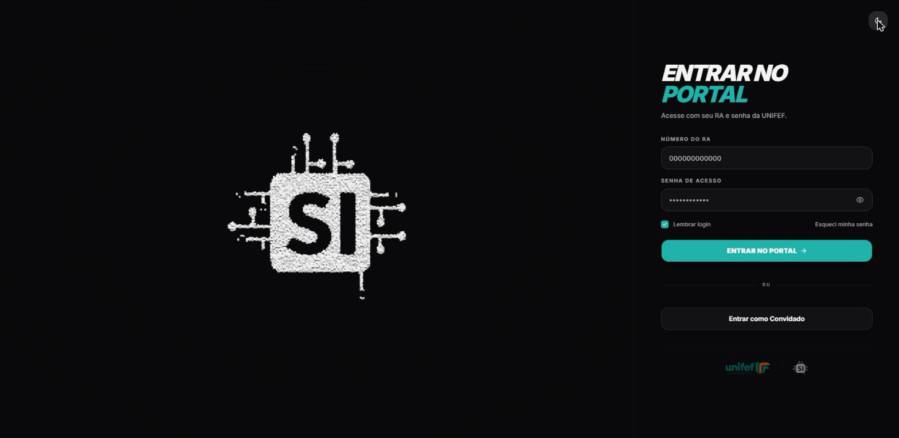
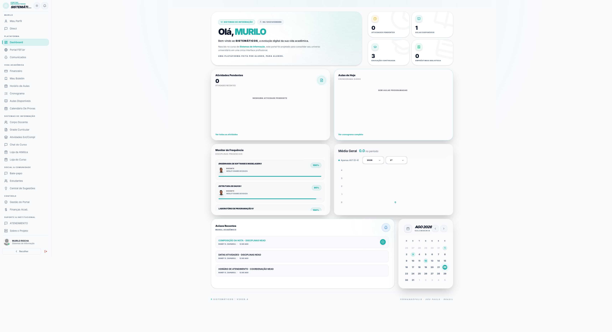
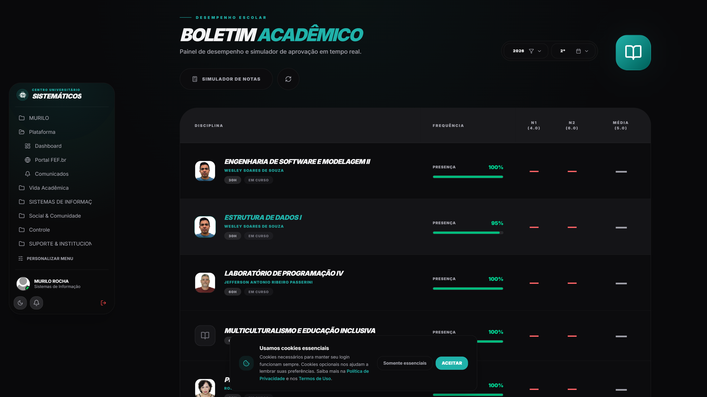
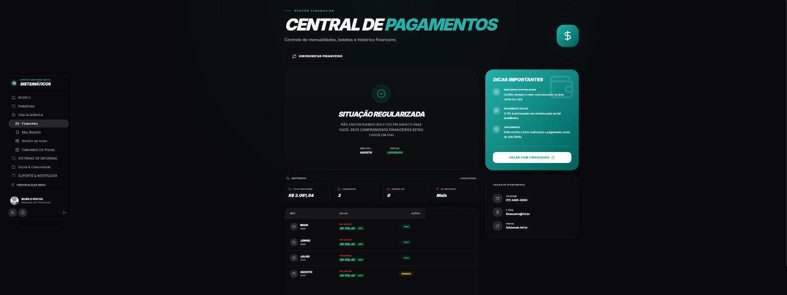
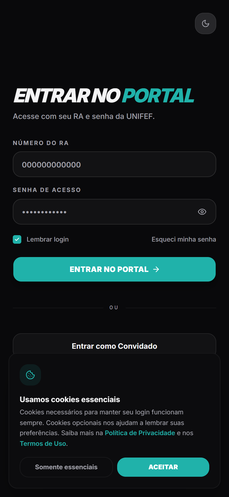
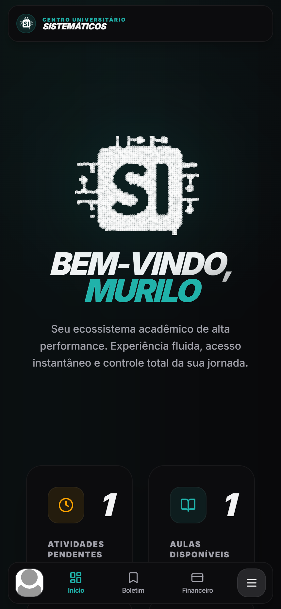
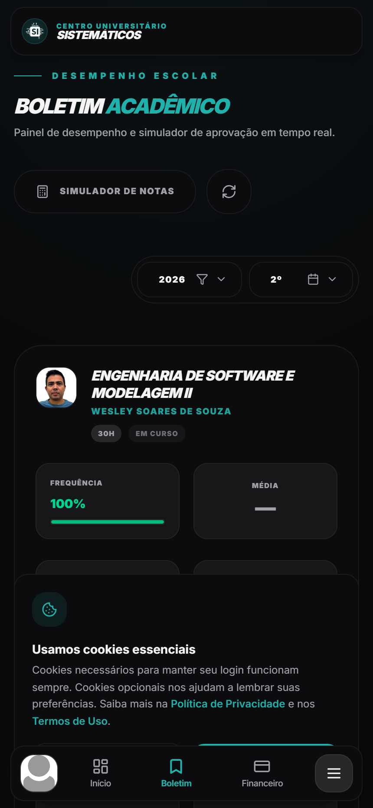
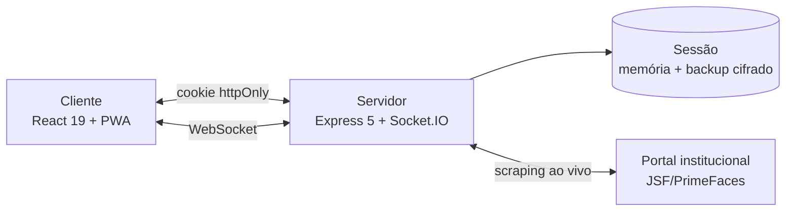

<h1 align="center">SISTEMÁTICOS</h1>

<p align="center"><em>Portal acadêmico não oficial para a comunidade da <strong>UniFEF</strong> — uma alternativa moderna e em tempo real ao sistema institucional legado.</em></p>

<p align="center">
  
</p>

<p align="center">
  
  
  
  
  
  
  
</p>

<p align="center">
  <strong><a href="https://sistematicos.site/">Portal Oficial: sistematicos.site ↗</a></strong>
  &nbsp;&nbsp;•&nbsp;&nbsp;
  <strong><a href="https://murilolol.github.io/sistematicos/">Vitrine Online & Diagramas Interativos ↗</a></strong>
</p>

<br>

> **TL;DR** — entre com seu RA e senha da FEF, veja notas/horários/boletos __em tempo real__ numa interface moderna, sem duplicar seus dados acadêmicos em nenhum lugar. Detalhes técnicos completos em [ARCHITECTURE.md](./ARCHITECTURE.md).

> **Avaliando este repositório / Banca Acadêmica?** Camada real-time sobre um portal acadêmico legado (JSF/PrimeFaces) que nunca duplica dados — **80 rotas HTTP e 22 eventos de Socket.IO**, todos com autorização derivada da sessão (zero-trust client-side), sessão cifrada em repouso transitório (AES-256-GCM) e exclusão de conta LGPD self-service. Solo, sem framework de boilerplate: React 19, Express 5, TypeScript, Tailwind v4. Aprofundando: [ARCHITECTURE.md](./ARCHITECTURE.md) para decisões de engenharia, [docs/api.md](./docs/api.md) para a referência completa da API, [site/sistematicos-apresentacao.pptx](./site/sistematicos-apresentacao.pptx) para o deck de slides de 28 páginas, ou a **[Vitrine Online Interativa](https://murilolol.github.io/sistematicos/)** para explorar tudo visualmente.

<br>

## Índice

- [Sobre](#sobre)
- [Privacidade, dados pessoais e LGPD](#privacidade-dados-pessoais-e-lgpd)
- [Módulos](#módulos)
- [Como usar](#como-usar)
- [Perguntas rápidas](#perguntas-rápidas)
- [Capturas de tela](#capturas-de-tela)
- [Stack](#stack)
- [Arquitetura](#arquitetura)
- [Vitrine, diagramas e apresentação](#vitrine-diagramas-e-apresentação)
- [Segurança e LGPD](#segurança-e-lgpd)
- [Licença e termos](#licença-e-termos)
- [Autoria](#autoria)
- [Aviso legal](#aviso-legal)

<br>

## Sobre

O sistema acadêmico oficial da UniFEF roda sobre uma stack legada (**JSF/PrimeFaces**): recarregamento síncrono de página, navegação lenta e pouquíssimo suporte a celular. Todo semestre, a mesma rotina se repete — abrir o portal para ver uma nota, consultar frequência em outra aba, entrar de novo para ver o boleto.

O **Sistemáticos** nasceu dessa frustração como aluno. Em vez de mais um sistema paralelo com seu próprio cadastro, ele funciona como uma camada moderna sobre o portal oficial: o aluno entra com o mesmo RA e senha que já usa, e passa a ver tudo — notas, frequência, horários, boletos, avisos — em uma interface única, rápida e em tempo real.

É um **projeto pessoal e acadêmico**, sem fins lucrativos e sem qualquer pretensão de concorrer comercialmente com sistemas de mercado — o objetivo é estritamente prático: resolver, de forma simples e intuitiva, um problema real da rotina de um aluno.

- **Zero atrito** — notas, faltas, horários, boletos e materiais em uma SPA fluida, sem recarregar página.
- **Sem duplicação de dados** — cada informação é buscada ao vivo direto do portal institucional; nada de notas desatualizadas em um banco paralelo.
> **Nota:** este repositório é uma *vitrine técnica*. O código-fonte do motor de sincronização e automação é proprietário e não é distribuído publicamente.

> A própria plataforma também tem uma versão *ao vivo* deste documento: a página **[Sobre o Projeto](https://sistematicos.site/sobre)**, dentro do portal, reúne visão geral, arquitetura, mapa de API e postura de segurança em abas navegáveis — pensada tanto para aluno curioso quanto para quem só quer confirmar o que é feito com os próprios dados.

### Sistemáticos vs. Portal Oficial: Matriz de Impacto

| Módulo | No Portal Oficial Legado (JSF) | No Sistemáticos (Camada Moderna) |
| :-- | :-- | :-- |
| **1. Boletim** | Tabelas estáticas sem cálculo, exigindo recarregar a página para trocar de semestre. | Média ponderada calculada na hora + **simulador de aprovação** (*"quanto preciso na P2?"*). |
| **2. Vida Acadêmica** | Cronograma em PDFs soltos e menus fragmentados. | Horários da semana, faltas limite e calendário de provas reunidos em uma visão única. |
| **3. Financeiro** | Apenas código de barras tradicional para download em PDF. | Visualização clara de parcelas + **gerador instantâneo de PIX Copia e Cola**. |
| **4. Comunicação** | Nenhum canal de comunicação entre alunos no portal. | **Chat em tempo real (Socket.IO)** por sala de turma, mensagens diretas e central de suporte. |
| **5. Google Classroom** | Aluno precisa alternar entre portais diferentes. | Feed sincronizado de atividades pendentes e materiais diretamente no painel. |
| **6. Hub Acadêmico** | Inexistente. | Banco colaborativo de provas antigas, calculadora e networking de estágio/carreira. |
| **7. Ferramentas** | Formatação manual de trabalhos pelo aluno. | **Gerador automático de capa ABNT** com dados institucionais pré-preenchidos. |
| **8. Tarefas** | Inexistente (dependência de apps externos). | **Quadro Kanban pessoal** integrado para organizar entregas e trabalhos em grupo. |
| **9. Avisos & Gestão** | Murais estáticos e circulares em PDF. | Comunicados segmentados por curso/semestre com painel para representantes. |
| **10. Comunidade** | Sem diretório de contatos. | Diretório de colegas, central de sugestões com votação aberta e loja da atlética. |
| **11. Infraestrutura & Apoio** | Custo institucional alto e manutenção complexa. | Modelo autossustentável via doações voluntárias, sem custo para o estudante. |
| **12. Interface & PWA** | Não responsivo, layout quebrado no celular. | **PWA instalável**, tema dark/light, busca universal (`Ctrl+K`) e navegação mobile pensada para uma mão. |

<br>

## Privacidade, dados pessoais e LGPD

Pedir para um aluno digitar o RA e a senha institucional em um site que não é o oficial é, com razão, motivo de desconfiança. Por isso, o funcionamento é deliberadamente simples de explicar — e as práticas abaixo seguem, na medida de um projeto pessoal, os princípios da **Lei Geral de Proteção de Dados (LGPD)**:

- **Finalidade e minimização** — a senha é usada **apenas para autenticar contra o portal oficial da FEF**, na hora do login, e nunca é enviada para nenhum outro lugar. O Sistemáticos **não tem banco de dados de notas, frequência ou matrícula** — essas informações são sempre lidas ao vivo do portal institucional, nunca armazenadas por aqui.
- **Segurança e não retenção** — a senha nunca é gravada em texto puro: fica cifrada (**AES-256-GCM**) em memória para uso imediato, e também num backup cifrado em disco que só existe para a sessão sobreviver a um restart do servidor — é descartada assim que a sessão expira (TTL de 12h, varredura a cada 5 min) ou o titular faz logout.
- **Consentimento livre e informado** — o tratamento de dados só ocorre porque o próprio aluno opta, voluntariamente, por inserir suas credenciais e usar a plataforma; o **modo convidado** existe justamente para quem prefere explorar a interface sem fornecer nenhum dado real. Um banner de cookies, exibido no primeiro acesso, deixa explícita a distinção entre cookies essenciais (login) e opcionais (preferências).
- **Auditoria com minimização** — cada login grava IP aproximado, cidade/dispositivo/navegador e horário, **nunca a senha** — e esse registro é **sobrescrito a cada novo login do mesmo RA**, em vez de acumular um histórico crescente: existe só o suficiente para investigar um acesso indevido, não para rastrear o aluno ao longo do tempo.
- **Transparência** — os detalhes técnicos completos de como isso é implementado (criptografia, cookies, expiração) estão documentados e abertos em **[ARCHITECTURE.md](./ARCHITECTURE.md)**, para qualquer pessoa auditar o raciocínio.
- **Direitos do titular** — o próprio aluno pode apagar sua conta a qualquer momento (self-service, dentro da plataforma): perfil, tarefas, lembretes e histórico financeiro são excluídos de fato; mensagens de chat e comentários públicos são anonimizados, não porque a exclusão seja recusada, mas porque apagá-los de verdade quebraria conversas e totais que outras pessoas ainda enxergam.

> Este README descreve as práticas técnicas em alto nível. A plataforma mantém, dentro dela mesma, uma **[Política de Privacidade](https://sistematicos.site/privacidade)** e **[Termos de Uso](https://sistematicos.site/termos)** completos, nos moldes da LGPD — vinculados também no rodapé do banner de cookies.

<br>

## Módulos

| Área | Descrição |
| :-- | :-- |
| **Boletim** | Notas, frequência por disciplina e simulador de médias — descubra quanto falta tirar na próxima prova para passar. |
| **Vida acadêmica** | Horário de aulas, cronograma, matriz curricular, calendário de provas e atividades complementares — tudo lido ao vivo do portal. |
| **Financeiro** | Mensalidades em aberto e quitadas, boleto e QR Code PIX para pagamento instantâneo. |
| **Comunicação** | Chat em tempo real da turma/curso, mensagens diretas privadas entre colegas e central de suporte. |
| **Classroom** | Feed de materiais e atividades sincronizado com o Google Classroom das disciplinas. |
| **Hub Acadêmico** | Calculadora de médias, banco de provas antigas, trilha de carreira e networking entre alunos — extensões que rodam em cima dos dados já carregados, sem novas chamadas ao portal. |
| **Ferramentas** | Gerador de capa no padrão ABNT com autopreenchimento (curso, autor, instituição) e simulador de aprovação. |
| **Tarefas** | Quadro Kanban pessoal para organizar entregas, trabalhos e provas. |
| **Avisos e gestão** | Mural de comunicados por curso/semestre, com painel administrativo para representantes de turma. |
| **Comunidade** | Diretório de estudantes e professores, central de sugestões com votação, e loja da atlética. |
| **Apoio ao projeto** | Doações voluntárias via PIX, com ranking opcional de apoiadores — mantém a infraestrutura sem cobrar do aluno. |
| **Interface** | Tema claro/escuro, busca universal (`Ctrl+K`), diálogos e notificações no próprio tema da aplicação (sem pop-up nativo do navegador) e instalação como app (PWA) no celular ou computador. |

<br>

## Como usar

1. Acesse **[sistematicos.site](https://sistematicos.site/)**.
2. Entre com o **RA e a senha** que você já usa no portal oficial da FEF — ou clique em **"Entrar como Convidado"** para explorar a interface sem se autenticar.
3. Pronto: o dashboard já carrega suas notas, horários e avisos em tempo real.

<br>

## Perguntas rápidas

> ### Isso é oficial da UniFEF?
> __Não.__ É um projeto independente, feito por um aluno — veja a seção [Aviso legal](#aviso-legal).

> ### Minha senha fica salva em algum lugar?
> Não em texto puro, e não permanentemente. Veja [Privacidade, dados pessoais e LGPD](#privacidade-dados-pessoais-e-lgpd) e, para o detalhe técnico exato, [ARCHITECTURE.md](./ARCHITECTURE.md).

> ### Minhas notas aparecem desatualizadas às vezes?
> Não deveriam — cada tela busca os dados *ao vivo* no portal oficial no momento em que você abre. Se o portal da FEF estiver instável, o Sistemáticos também sente.

> ### Posso usar sem ser aluno da FEF?
> Sim, pelo modo convidado (botão `Entrar como Convidado` na tela de login) — você navega pela interface com dados de exemplo, sem autenticar.

> ### O app funciona offline?
> Parcialmente: é um PWA instalável, mas só páginas públicas (avisos, notícias institucionais) ficam em cache. Boletim, financeiro e horário sempre exigem conexão, *de propósito* — para nunca guardar seus dados pessoais no dispositivo.

> ### Achei um bug ou tenho uma ideia — pra onde eu mando?
> Dentro do próprio portal, use a **Central de Sugestões** — é lida direto pelo autor. Para algo técnico sobre este repositório, abra uma [issue](https://github.com/murilolol/sistematicos/issues).

> ### O Sistemáticos cobra alguma coisa do aluno?
> Não, o uso da plataforma é **inteiramente gratuito**. Existem duas frentes financeiras opcionais e desacopladas do login: a **Loja da Atlética** (pedidos via WhatsApp, o pagamento não passa pelo Sistemáticos) e **doações voluntárias** via PIX para ajudar a custear a infraestrutura — nenhuma das duas é necessária para usar boletim, horários, chat ou qualquer outro módulo acadêmico.

<br>

## Capturas de tela

<p align="center">
  
  
</p>

<p align="center">
  
  
</p>

### Mobile

<p align="center">
  
  
  
</p>

> A sidebar desktop vira navegação inferior (bottom nav) em telas de celular — não é a mesma interface encolhida, é outro layout, pensado para uso de uma mão.

<br>

## Stack

- **Frontend**
  - React 19 + TypeScript
  - Vite 6
  - Tailwind CSS v4 + shadcn/ui
  - Framer Motion
- **Backend**
  - Node.js + Express 5
  - Socket.IO _(tempo real, multiplexado em salas)_
  - Cheerio _(parsing/sincronização)_
- **Sessão e segurança**
  - Cookies `httpOnly`
  - Sessão criptografada com **AES-256-GCM** (memória + backup em disco)
  - RA sempre resolvido a partir da sessão — nunca de um campo enviado pelo cliente

<br>

## Arquitetura

O servidor não guarda o registro acadêmico do aluno — ele mantém apenas uma sessão-ponte em memória e resolve cada requisição ao vivo contra o portal institucional (JSF/PrimeFaces), emulando o formulário real de login e navegação.



O documento **[ARCHITECTURE.md](./ARCHITECTURE.md)** é a referência completa para desenvolvedores e curiosos: diagramas de sequência do fluxo de login e da renovação automática de sessão, o adaptador de scraping reaproveitado por toda a camada acadêmica, a topologia de salas do Socket.IO e as decisões de arquitetura (e seus trade-offs) por trás de cada escolha. O mapa completo das 80 rotas da API e dos 22 eventos de Socket.IO — agrupados em 13 domínios, com o que cada grupo exige de autorização e exemplos de request/response — está em **[docs/api.md](./docs/api.md)** (ou na versão navegável [site/api.html](./site/api.html)).

Um gostinho do que tem lá — o formato de resposta do login, já sem nenhum dado da sessão institucional:

```json
{
  "user": {
    "fullName": "Murilo Rocha Silva",
    "course": "Sistemas de Informação",
    "currentSemester": "4º Semestre"
  }
}
```

<br>

## Vitrine, diagramas e apresentação

Além dos documentos em Markdown, este repositório tem uma versão navegável, visual, de tudo isso — pensada para quem prefere ler numa página a rolar um README:

| Recurso | O que tem |
| :-- | :-- |
| **[site/index.html](./site/index.html)** | Mini-site de uma página: hero, diagrama simplificado de como o sistema funciona, comparação com o portal oficial, os 12 módulos, uma seção de "rigor de engenharia" com números reais e a galeria de screenshots. |
| **[site/api.html](./site/api.html)** | A mesma referência de [docs/api.md](./docs/api.md), com syntax highlighting real (JSON, Python, TypeScript, bash) e exemplos de resposta por domínio. |
| **[site/diagramas.html](./site/diagramas.html)** | Cinco diagramas técnicos desenhados à mão em SVG: arquitetura completa do servidor, modelo de dados local (ER), sequência UML do login, topologia de salas do Socket.IO e a árvore das três camadas de rotas do frontend. |
| **[site/sistematicos-apresentacao.pptx](./site/sistematicos-apresentacao.pptx)** | Apresentação em slides (28 slides) cobrindo o projeto de ponta a ponta — problema, arquitetura, segurança, LGPD e o trabalho de hardening — pensada para uma banca ou coordenador de curso. |
| **[docs/roteiro-apresentacao.md](./docs/roteiro-apresentacao.md)** | Roteiro prático de apresentação de 10 minutos para bancas e professores, incluindo roteiro de Live Demo e FAQ com as 5 perguntas técnicas mais difíceis respondidas. |

<br>

## Segurança e LGPD

A postura de segurança, o modelo de criptografia em memória (**AES-256-GCM**), a política de descarte de senhas e os canais confidenciais para reporte de vulnerabilidades estão formalizados em:
- **[SECURITY.md](./SECURITY.md)** — Política de Segurança, Controles Técnicos e Divulgação Responsável.
- **[ARCHITECTURE.md](./ARCHITECTURE.md)** — Racional completo de engenharia, isolamento de sessão e fluxo de dados.

<br>

## Licença e termos

Os termos de uso da documentação, direitos autorais e regras desta vitrine acadêmica estão descritos em:
- **[LICENSE](./LICENSE)** — Licença de Demonstração Técnica e Propriedade Intelectual.

<br>

## Autoria

Idealizado, desenhado e desenvolvido **individualmente** por **Murilo Rocha Silva** — 19 anos, programando há 3, cursando o 4º semestre de Sistemas de Informação na UniFEF — sem financiamento externo ou equipe.

[](https://github.com/murilolol)
[](https://instagram.com/muriloodev)
[](https://linkedin.com/in/murilodev)

> © Murilo Rocha Silva. Todos os direitos sobre o design, a arquitetura e o código-fonte são reservados ao autor.

<br>

## Aviso legal

_O Sistemáticos é um projeto pessoal, acadêmico e sem fins lucrativos, independente e sem vínculo formal ou endosso institucional por parte da UniFEF (Fundação Educacional de Fernandópolis). Não tem finalidade comercial nem pretensão de concorrer com sistemas de mercado, e não substitui os canais oficiais para atos jurídicos e matrículas. O tratamento de dados pessoais segue os princípios descritos em [Privacidade, dados pessoais e LGPD](#privacidade-dados-pessoais-e-lgpd)._

### Canais oficiais da instituição

Para qualquer assunto relativo à **instituição de ensino** em si — matrícula, registro acadêmico oficial, ou uma solicitação formal de LGPD sobre os dados que a própria FEF mantém — use os canais oficiais, e não este repositório:

| Canal | Contato |
| :-- | :-- |
| Site institucional | [fef.br](https://fef.br) |
| Endereço | Av. Theotônio Vilela, 1685 — Jardim Vitória, Fernandópolis/SP — CEP 15608-380 |
| Ouvidoria | [fef.br/fefsisweb/#/ouvidoria](https://fef.br/fefsisweb/#/ouvidoria) |
| Encarregado de Dados (LGPD) | lgpd@fef.edu.br |

> O Encarregado de Dados acima é o **da instituição oficial**, não do Sistemáticos — ele trata de solicitações sobre o registro acadêmico mantido pela FEF. Para qualquer questão sobre este projeto especificamente, use os canais descritos em [Autoria](#autoria) ou abra uma [issue](https://github.com/murilolol/sistematicos/issues).
