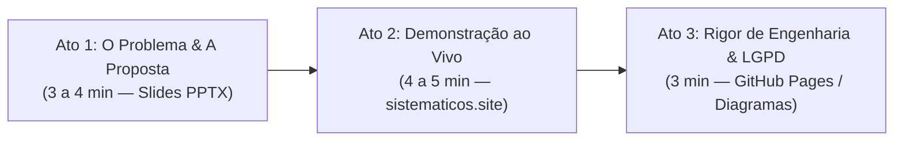

# Roteiro de Apresentação Técnica e Acadêmica — Sistemáticos

Este documento é o guia prático para apresentação do projeto **Sistemáticos** perante o coordenador de curso, banca avaliadora ou professores da UniFEF.

---

## 🎯 Visão Geral da Apresentação (Duração: 10 a 15 minutos)

A apresentação é estruturada em **3 atos**:

---

## ⏱️ Roteiro Passo a Passo

### Ato 1: O Problema e a Proposta de Valor (Slides PPTX — 3 a 4 min)

1. **Abertura (Slide 1-3)**:
   - *"Bom dia/Boa tarde, professor. Hoje quero apresentar o Sistemáticos: uma plataforma acadêmica moderna em tempo real, desenvolvida como uma camada sobre o portal acadêmico oficial da UniFEF."*
   - Contextualize o problema real: o sistema oficial roda sobre JSF/PrimeFaces legado, com recarregamento síncrono de página, experiência difícil em dispositivos móveis e processos fragmentados para o aluno.
2. **A Solução e os 12 Módulos (Slide 4-8)**:
   - *"Em vez de criar mais um banco de dados paralelo e pedir pro aluno cadastrar tudo de novo, o Sistemáticos atua como um gateway inteligente: o aluno entra com seu RA e senha e ganha uma SPA fluida com 12 módulos integrados."*
   - Destaque: Boletim com simulador de médias, financeiro com PIX instantâneo, chat em tempo real por turma e sincronização com Google Classroom.

---

### Ato 2: Demonstração Prática ao Vivo (sistematicos.site — 4 a 5 min)

1. **Acesso com Modo Convidado**:
   - Abra [sistematicos.site](https://sistematicos.site/) e clique em **"Entrar como Convidado"** (ou use credenciais de teste).
2. **Tour Pelos Módulos-Chave**:
   - **Dashboard & Boletim**: Mostre o cálculo dinâmico de médias e a simulação de aprovação (*"quanto preciso tirar na P2?"*).
   - **Financeiro com PIX**: Mostre a geração instantânea do QR Code Copia e Cola para pagamento de mensalidade sem atrito.
   - **Chat em Tempo Real**: Demonstre o envio de mensagens instantâneas via Socket.IO multiplexado por salas de turma/curso.
   - **Mobile PWA**: Abra as ferramentas do desenvolvedor (F12) no modo celular ou mostre no próprio smartphone para evidenciar a barra de navegação inferior (bottom navigation) pensada para uso com uma mão.

---

### Ato 3: Rigor de Engenharia, Segurança e LGPD (Vitrine Técnica — 3 min)

1. **Zero Duplicação de Dados**:
   - *"O servidor do Sistemáticos não armazena o histórico acadêmico ou notas do aluno em disco. Cada requisição é resolvida ao vivo direto contra o portal institucional."*
2. **Segurança das Credenciais**:
   - Explique o modelo de sessão efêmera:
     - Senhas cifradas em memória com **AES-256-GCM**.
     - Cookies de sessão emitidos com `httpOnly`, `SameSite=Lax` e `Secure`.
     - TTL de 12 horas com varredura periódica e descarte imediato no logout.
3. **Vitrine Técnica & Diagramas**:
   - Mostre rapidamente a página de diagramas ([site/diagramas.html](https://murilolol.github.io/sistematicos/diagramas.html)) e a referência das 80 rotas da API.

---

## 🛡️ FAQ da Banca: Respostas Prontas para as Perguntas Mais Difíceis

### 1. "O sistema sobrecarrega o servidor oficial da FEF com requisições repetidas?"
> **Resposta:** *"Não. O servidor implementa de-duplicação de requisições de scraping em voo e sessões multiplexadas. Se múltiplos componentes do frontend requisitarem dados simultaneamente, o backend faz apenas uma única chamada consolidada ao portal JSF, reaproveitando a resposta em memória durante a navegação do aluno."*

### 2. "Como você garante que um aluno não veja as notas de outro?"
> **Resposta:** *"A autorização é 100% resolvida pelo servidor com base na sessão criptografada (`sistematicos_sid`). Em nenhuma rota o backend aceita parâmetros como `ra` ou `student_id` vindos do cliente para consultas acadêmicas. O servidor extrai o contexto autenticado da própria sessão validada, eliminando qualquer risco de Broken Object Level Authorization (BOLA/IDOR)."*

### 3. "Como o projeto se alinha com a LGPD se não é um sistema oficial da instituição?"
> **Resposta:** *"O projeto segue estritamente os princípios da LGPD: consentimento voluntário (o aluno opta por usar, havendo modo convidado para exploração sem dados reais), minimização (apenas os dados necessários para renderizar a tela), criptografia de ponta a ponta e direito à exclusão definitiva (self-service na plataforma com anonimização de histórico público)."*

### 4. "O que acontece quando o portal da FEF altera o HTML ou entra em manutenção?"
> **Resposta:** *"A camada de scraping foi construída com seletores semânticos resilientes e tratamento defensivo de exceções. Se o portal oficial estiver fora do ar ou exibir interstitials (como avisos institucionais de tela cheia), o middleware do Sistemáticos detecta e dispensa os modais automaticamente ou emite mensagens claras de indisponibilidade momentânea da fonte oficial."*

### 5. "Por que você optou por React 19 + Express 5 em vez de frameworks fullstack prontos como Next.js?"
> **Resposta:** *"Pela necessidade de controle cirúrgico sobre o ciclo de vida dos WebSockets (Socket.IO multiplexado em salas) e o gateway de sessões em memória com cookies HTTP-only customizados em um único processo Node.js leve, ideal para deploy enxuto em VPS com baixo custo operacional."*
